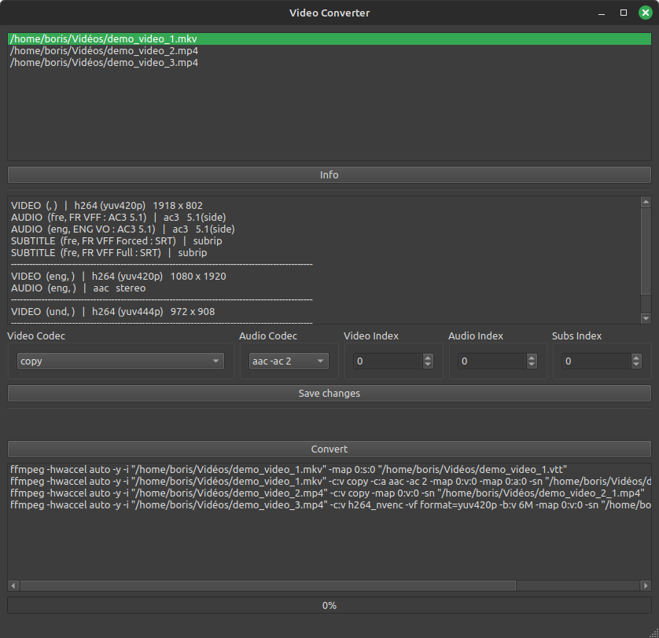

# VideoConverter

A software to convert mkv or mp4 video files to mp4 video files readable natively on any web navigator.

## What makes a video readable anywhere ?

In order to play a video natively on any web navigator, it needs to be in a MP4 container.  
The video codec has to be `h264`, and the format has to be `yuv420p`.  
The audio codec has to be `aac`, and it must be in stereo (2 channels) on mobile devices.

This software uses `ffmpeg` to convert video files in the right format.
It also extracts subtitles in VTT format, widely supported.

## How to build

Replace the `{path_to_Qt6}` with the path to Qt. Be sure to have Qt6 installed.  
Replace `{NB_CORES}` by the number of cores to use to compile the project.

```bash
git clone https://github.com/borisbordeaux/VideoConverter.git
cd VideoConverter
mkdir build
cd build
export QT_PATH={path_to_Qt6}/gcc_64
cmake -DCMAKE_BUILD_TYPE=Release ..
make -j {NB_CORES}
```

## How to use

Be sure to have `ffmpeg` and `ffprobe` in your PATH as this software uses these programs to convert and get information of video files.
Then follow the following steps: 
- Drag and drop .mkv or .mp4 video files in the window.
- Double click on any video file in the list to remove it.
- Click on the `Info` button to see all available streams of each video file.
- Select a video file to edit the parameters of the `ffmpeg` command.
- Double click on any command in the list to remove it.
- Click on the `Convert` button to start the conversion.

The progress bar indicates the progression of the current command. Once terminated, the command is removed from the list.

